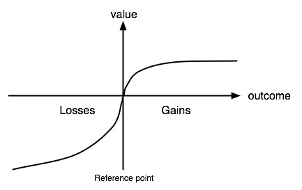

#ln 
# 展望理論
標籤： #損失趨避 #心理現象 #展望理論 #獲利方法 #消費者的心理學 
來源：[[《黑天鵝效應》]] 附註

---

展望理論係描述壞和好的隨機事件之間的不對稱性，但該理論還顯示出負面領域具凸性（convex），而正面領域為凹性（concave），意思是，一次損失一百元比損失一元一百次的痛苦為少；但一次賺一百元的樂趣則遠低於賺一百次一元。

展望理論主要包含人的預期基準與損失趨避心理。
面對獲利時，因為怕拿不到預期的獲利，反而會不願意冒險、避免失去；面對損失時，反而會願意冒險，為了減少損失。
